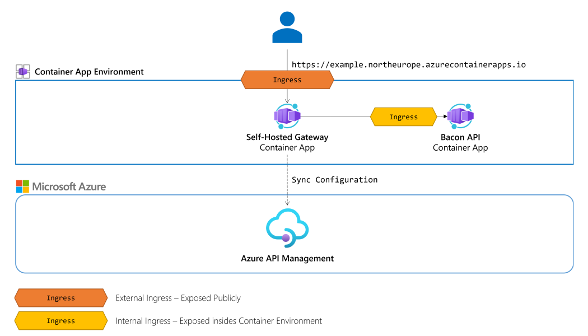
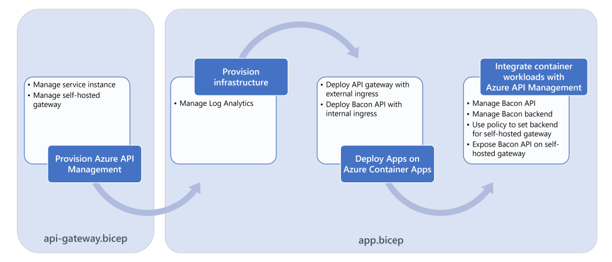

# Azure API Management's Self-Hosted Gateway on Azure Container Apps

Playground to run Azure API Management's self-hosted gateway on Azure Container Apps.

## Scenario 🗺️



## See it in action! 🚀

### Deploying the sample

1. Deploy the Azure API Management with Bicep, for example:
```shell
az deployment group create --resource-group <rg-name> --template-file .\deploy\api-gateway.bicep --parameters resourceNamePrefix='apim-container-apps-sandbox'
```
2. Generate a gateway token in the "Deployment" blade of your self-hosted gateway
3. Deploy the application to Azure Container Apps with Bicep, for example:
```shell
az deployment group create --resource-group <rg-name> --template-file .\deploy\app.bicep --parameters resourceNamePrefix='apim-container-apps-sandbox' apiManagementName='<apim-name>' selfHostedGatewayToken='<token>'
```

Behind the scenes, the application is deployed to Azure Container Apps with the following steps:


### Getting bacon through the API Gateway on Azure Container Apps

1. Create a new subscription in Azure API Management
2. Copy your subscription key from the Azure portal
3. Interact with the API Gateway
```shell
curl -i http://apim-container-apps-api-gateway.ashystone-8df9d4e5.westeurope.azurecontainerapps.io/bacon/api/v1/bacon -H "X-API-Key: <subscription-key>"
HTTP/1.1 200 OK
content-type: application/json; charset=utf-8
date: Fri, 22 Apr 2022 09:14:57 GMT
server: Kestrel
transfer-encoding: chunked

["Honey Barbecue Flavored Bacon","Infamous Black Pepper Bacon","Italian Bacon","Raspberry Chipotle","Pumpkin Pie Spiced"]t
```

## Limitations

- Workloads are currently exposed with HTTP, instead of HTTPS
